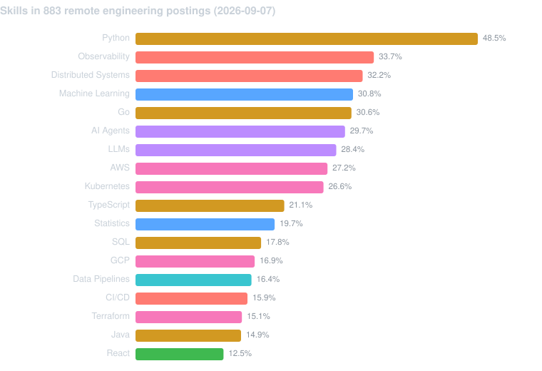
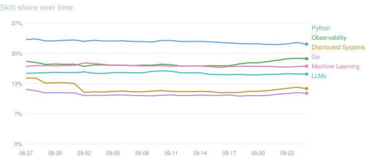
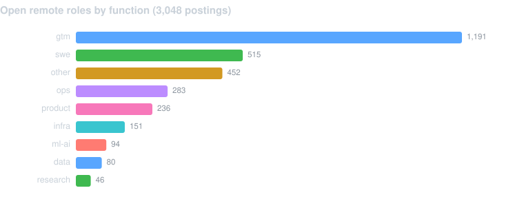
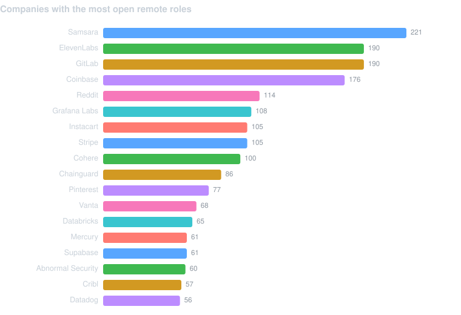

# AI Job Radar

> Daily snapshot of what AI and tech companies are hiring for in remote roles, built from public job-board APIs. Updated every morning by GitHub Actions.

**2026-09-05** — tracking **3,064 open remote roles** across **95 companies** (887 of them engineering roles). 1,713 postings disclose pay. **40 appeared today.**

<sub>Remote-only: 14,122 postings were collected across all locations and 21.7% of them were remote. Set `remote_only` to false in `config/settings.json` to track every location.</sub>

---

## Most-requested skills in remote engineering roles

Share of the 887 remote engineering postings that mention each skill.



<details><summary>Full skill table</summary>

| # | Skill | Category | Postings | Share |
|---:|---|---|---:|---:|
| 1 | Python | Languages | 429 | 48.4% |
| 2 | Observability | Practices | 302 | 34.0% |
| 3 | Distributed Systems | Practices | 287 | 32.4% |
| 4 | Machine Learning | ML Fundamentals | 274 | 30.9% |
| 5 | Go | Languages | 272 | 30.7% |
| 6 | AI Agents | LLM & GenAI | 261 | 29.4% |
| 7 | LLMs | LLM & GenAI | 253 | 28.5% |
| 8 | AWS | Infra & Cloud | 241 | 27.2% |
| 9 | Kubernetes | Infra & Cloud | 239 | 26.9% |
| 10 | TypeScript | Languages | 187 | 21.1% |
| 11 | Statistics | ML Fundamentals | 174 | 19.6% |
| 12 | SQL | Languages | 157 | 17.7% |
| 13 | GCP | Infra & Cloud | 150 | 16.9% |
| 14 | Data Pipelines | Data Engineering | 145 | 16.3% |
| 15 | CI/CD | Practices | 140 | 15.8% |
| 16 | Terraform | Infra & Cloud | 133 | 15.0% |
| 17 | Java | Languages | 132 | 14.9% |
| 18 | React | Frameworks & Libraries | 113 | 12.7% |
| 19 | Azure | Infra & Cloud | 105 | 11.8% |
| 20 | Snowflake / BigQuery | Data Engineering | 84 | 9.5% |
| 21 | Airflow | Data Engineering | 82 | 9.2% |
| 22 | Kafka | Data Engineering | 75 | 8.5% |
| 23 | Spark | Data Engineering | 72 | 8.1% |
| 24 | Rust | Languages | 72 | 8.1% |
| 25 | Evals | LLM & GenAI | 71 | 8.0% |
| 26 | Docker | Infra & Cloud | 63 | 7.1% |
| 27 | Linux | Infra & Cloud | 55 | 6.2% |
| 28 | Security | Practices | 52 | 5.9% |
| 29 | PyTorch | Frameworks & Libraries | 51 | 5.7% |
| 30 | Databricks | Data Engineering | 48 | 5.4% |
| 31 | RAG | LLM & GenAI | 47 | 5.3% |
| 32 | MCP | LLM & GenAI | 46 | 5.2% |
| 33 | dbt | Data Engineering | 45 | 5.1% |
| 34 | A/B Testing | Practices | 44 | 5.0% |
| 35 | Prompt Engineering | LLM & GenAI | 44 | 5.0% |
| 36 | Deep Learning | ML Fundamentals | 43 | 4.8% |
| 37 | Recommender Systems | ML Fundamentals | 42 | 4.7% |
| 38 | MLOps | Practices | 41 | 4.6% |
| 39 | AI Safety | LLM & GenAI | 37 | 4.2% |
| 40 | Fine-tuning | LLM & GenAI | 37 | 4.2% |

</details>

## Movers

Change in share of postings since 2026-08-29, in percentage points.

| Rising | Δ pp | | Falling | Δ pp |
|---|---:|---|---|---:|
| Statistics | +0.35 | | Azure | -2.41 |
| CI/CD | +0.21 | | GCP | -2.25 |
| MCP | +0.20 | | Distributed Systems | -1.83 |
| Databricks | +0.14 | | AWS | -1.36 |
| Security | +0.12 | | Kubernetes | -1.26 |
| AI Agents | +0.08 | | Kafka | -1.06 |
| Machine Learning | +0.08 | | Spark | -0.82 |
| Ray | +0.07 | | TypeScript | -0.80 |



## Where the roles are



| Role family | Postings | Share |
|---|---:|---:|
| gtm | 1,190 | 38.8% |
| swe | 517 | 16.9% |
| other | 473 | 15.4% |
| ops | 283 | 9.2% |
| product | 231 | 7.5% |
| infra | 154 | 5.0% |
| ml-ai | 94 | 3.1% |
| data | 79 | 2.6% |
| research | 43 | 1.4% |

## Disclosed pay, remote engineering roles

567 of 887 engineering postings (64%) publish a salary range. Figures are the midpoint of the posted band.

| Percentile | Midpoint |
|---|---:|
| 25th | $195,000 |
| Median | $228,500 |
| 75th | $260,000 |
| 90th | $290,000 |

<details><summary>Highest disclosed engineering bands by company</summary>

| Company | Top posted midpoint |
|---|---:|
| Anthropic | $675,000 |
| OpenAI | $455,500 |
| Pinterest | $371,087 |
| Reddit | $351,000 |
| Vanta | $349,500 |
| Databricks | $343,425 |
| Agility Robotics | $329,500 |
| Mercury | $325,900 |
| Snorkel AI | $316,000 |
| Hightouch | $310,000 |

</details>

## Who is hiring most



---

## How this works

Every day at 08:00 UTC a GitHub Actions workflow queries the public job-board APIs of the companies in [`config/companies.json`](config/companies.json) — Greenhouse, Lever and Ashby all expose unauthenticated JSON endpoints. Each posting's description is scanned for the ~66 technologies defined in [`config/skills.json`](config/skills.json), then the description text is discarded and only the derived record is stored.

| Path | What it holds |
|---|---|
| `data/trends.csv` | One row per skill per day — the long-run time series |
| `data/seen.csv` | Every posting id and the date it first appeared |
| `data/snapshots/<week>.json.gz` | Full postings, archived weekly |
| `data/summary.json` | Aggregates for the latest run |
| `config/companies.json` | Tracked companies and their ATS slugs |
| `config/profile.json` | Your skills — drives the daily match issue |
| `config/settings.json` | `remote_only` and other pipeline switches |

### Adding a company

Job boards are keyed by an ATS slug that has to be discovered. Append `Name,slug-guess` lines to a text file and run the prober, which tries all three platforms and keeps whatever answers:

```bash
python src/probe_slugs.py candidates.txt > config/companies.json
```

### Caveats

- Skills are matched by keyword, so a description that merely mentions a technology counts the same as one that requires it.
- Company boilerplate repeated across most of a company's postings is stripped before matching; without that, an "About us" blurb would register as a skill on every role.
- Coverage is limited to companies using Greenhouse, Lever or Ashby. Firms on Workday and Taleo are absent, which skews toward startups and scale-ups.
- Counts include every posted location for a role, so widely-posted roles are represented more than once.
- Remote status comes from each board's own field where one exists and from the posted location otherwise. Ashby's `isRemote` is ignored because boards set it true on hybrid onsite roles; its `workplaceType` is used instead.


<sub>Generated 2026-09-05T11:37:59+00:00 · 2 board(s) unreachable this run</sub>
