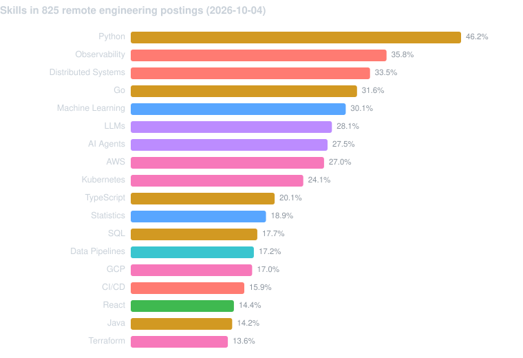
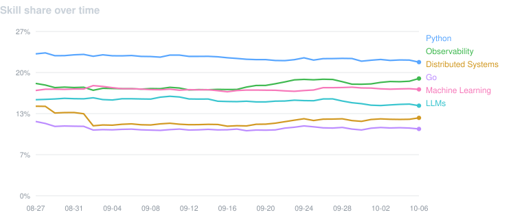
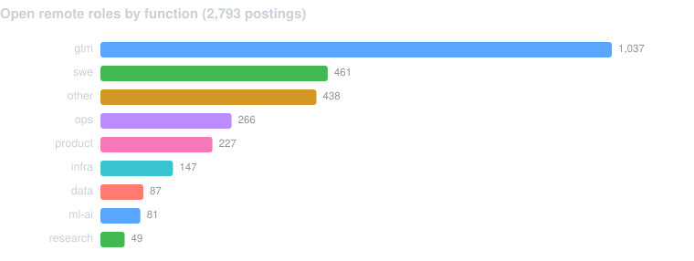
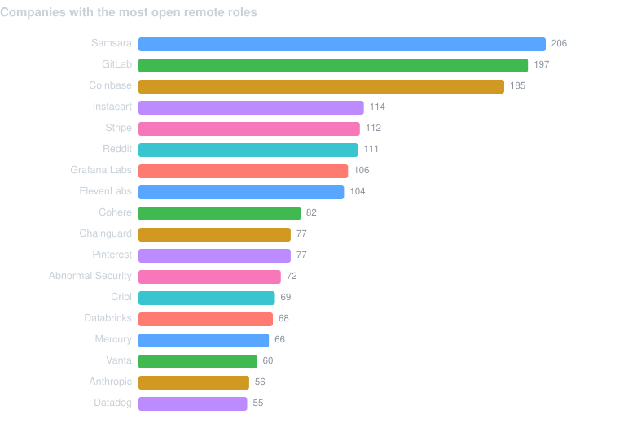

# AI Job Radar

> Daily snapshot of what AI and tech companies are hiring for in remote roles, built from public job-board APIs. Updated every morning by GitHub Actions.

**2026-10-03** — tracking **2,830 open remote roles** across **91 companies** (825 of them engineering roles). 1,626 postings disclose pay. **60 appeared today.**

<sub>Remote-only: 14,237 postings were collected across all locations and 19.9% of them were remote. Set `remote_only` to false in `config/settings.json` to track every location.</sub>

---

## Most-requested skills in remote engineering roles

Share of the 825 remote engineering postings that mention each skill.



<details><summary>Full skill table</summary>

| # | Skill | Category | Postings | Share |
|---:|---|---|---:|---:|
| 1 | Python | Languages | 380 | 46.1% |
| 2 | Observability | Practices | 295 | 35.8% |
| 3 | Distributed Systems | Practices | 277 | 33.6% |
| 4 | Go | Languages | 260 | 31.5% |
| 5 | Machine Learning | ML Fundamentals | 248 | 30.1% |
| 6 | LLMs | LLM & GenAI | 232 | 28.1% |
| 7 | AI Agents | LLM & GenAI | 225 | 27.3% |
| 8 | AWS | Infra & Cloud | 223 | 27.0% |
| 9 | Kubernetes | Infra & Cloud | 202 | 24.5% |
| 10 | TypeScript | Languages | 164 | 19.9% |
| 11 | Statistics | ML Fundamentals | 156 | 18.9% |
| 12 | SQL | Languages | 146 | 17.7% |
| 13 | Data Pipelines | Data Engineering | 142 | 17.2% |
| 14 | GCP | Infra & Cloud | 140 | 17.0% |
| 15 | CI/CD | Practices | 131 | 15.9% |
| 16 | Java | Languages | 117 | 14.2% |
| 17 | React | Frameworks & Libraries | 117 | 14.2% |
| 18 | Terraform | Infra & Cloud | 114 | 13.8% |
| 19 | Azure | Infra & Cloud | 87 | 10.5% |
| 20 | Snowflake / BigQuery | Data Engineering | 79 | 9.6% |
| 21 | Airflow | Data Engineering | 78 | 9.5% |
| 22 | Kafka | Data Engineering | 78 | 9.5% |
| 23 | Spark | Data Engineering | 65 | 7.9% |
| 24 | Rust | Languages | 65 | 7.9% |
| 25 | Security | Practices | 53 | 6.4% |
| 26 | Docker | Infra & Cloud | 53 | 6.4% |
| 27 | PyTorch | Frameworks & Libraries | 48 | 5.8% |
| 28 | Linux | Infra & Cloud | 47 | 5.7% |
| 29 | AI Safety | LLM & GenAI | 46 | 5.6% |
| 30 | Evals | LLM & GenAI | 45 | 5.5% |
| 31 | dbt | Data Engineering | 45 | 5.5% |
| 32 | MLOps | Practices | 42 | 5.1% |
| 33 | RAG | LLM & GenAI | 41 | 5.0% |
| 34 | MCP | LLM & GenAI | 40 | 4.8% |
| 35 | Recommender Systems | ML Fundamentals | 40 | 4.8% |
| 36 | Databricks | Data Engineering | 39 | 4.7% |
| 37 | Deep Learning | ML Fundamentals | 38 | 4.6% |
| 38 | TensorFlow | Frameworks & Libraries | 34 | 4.1% |
| 39 | Fine-tuning | LLM & GenAI | 32 | 3.9% |
| 40 | A/B Testing | Practices | 31 | 3.8% |

</details>

## Movers

Change in share of postings since 2026-09-26, in percentage points.

| Rising | Δ pp | | Falling | Δ pp |
|---|---:|---|---|---:|
| CI/CD | +0.34 | | LLMs | -0.96 |
| AI Safety | +0.33 | | AI Agents | -0.69 |
| Java | +0.31 | | Kubernetes | -0.53 |
| Speech / Audio | +0.30 | | Docker | -0.49 |
| React | +0.29 | | TypeScript | -0.43 |
| Snowflake / BigQuery | +0.19 | | Evals | -0.41 |
| Terraform | +0.15 | | Observability | -0.37 |
| MLOps | +0.14 | | Data Pipelines | -0.31 |



## Where the roles are



| Role family | Postings | Share |
|---|---:|---:|
| gtm | 1,061 | 37.5% |
| swe | 469 | 16.6% |
| other | 451 | 15.9% |
| ops | 270 | 9.5% |
| product | 223 | 7.9% |
| infra | 147 | 5.2% |
| ml-ai | 84 | 3.0% |
| data | 79 | 2.8% |
| research | 46 | 1.6% |

## Disclosed pay, remote engineering roles

556 of 825 engineering postings (67%) publish a salary range. Figures are the midpoint of the posted band.

| Percentile | Midpoint |
|---|---:|
| 25th | $196,285 |
| Median | $225,800 |
| 75th | $256,000 |
| 90th | $280,000 |

<details><summary>Highest disclosed engineering bands by company</summary>

| Company | Top posted midpoint |
|---|---:|
| Anthropic | $675,000 |
| OpenAI | $455,500 |
| Pinterest | $371,087 |
| Reddit | $351,000 |
| Databricks | $343,425 |
| Agility Robotics | $329,500 |
| Snorkel AI | $316,000 |
| Discord | $306,000 |
| GitLab | $301,800 |
| Pika | $292,500 |

</details>

## Who is hiring most



---

## How this works

Every day at 08:00 UTC a GitHub Actions workflow queries the public job-board APIs of the companies in [`config/companies.json`](config/companies.json) — Greenhouse, Lever and Ashby all expose unauthenticated JSON endpoints. Each posting's description is scanned for the ~66 technologies defined in [`config/skills.json`](config/skills.json), then the description text is discarded and only the derived record is stored.

| Path | What it holds |
|---|---|
| `data/trends.csv` | One row per skill per day — the long-run time series |
| `data/seen.csv` | Every posting id and the date it first appeared |
| `data/snapshots/<week>.json.gz` | Full postings, archived weekly |
| `data/summary.json` | Aggregates for the latest run |
| `config/companies.json` | Tracked companies and their ATS slugs |
| `config/profile.json` | Your skills — drives the daily match issue |
| `config/settings.json` | `remote_only` and other pipeline switches |

### Adding a company

Job boards are keyed by an ATS slug that has to be discovered. Append `Name,slug-guess` lines to a text file and run the prober, which tries all three platforms and keeps whatever answers:

```bash
python src/probe_slugs.py candidates.txt > config/companies.json
```

### Caveats

- Skills are matched by keyword, so a description that merely mentions a technology counts the same as one that requires it.
- Company boilerplate repeated across most of a company's postings is stripped before matching; without that, an "About us" blurb would register as a skill on every role.
- Coverage is limited to companies using Greenhouse, Lever or Ashby. Firms on Workday and Taleo are absent, which skews toward startups and scale-ups.
- Counts include every posted location for a role, so widely-posted roles are represented more than once.
- Remote status comes from each board's own field where one exists and from the posted location otherwise. Ashby's `isRemote` is ignored because boards set it true on hybrid onsite roles; its `workplaceType` is used instead.


<sub>Generated 2026-10-03T13:03:01+00:00 · 4 board(s) unreachable this run</sub>
