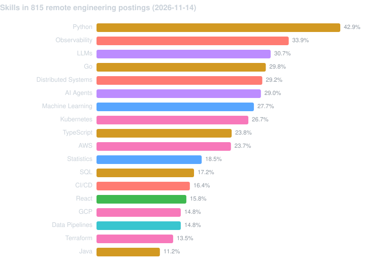
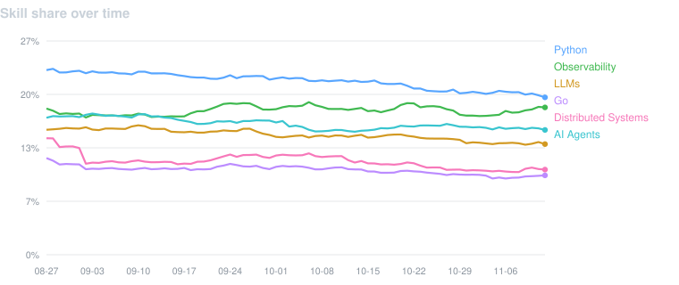
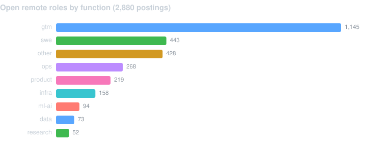
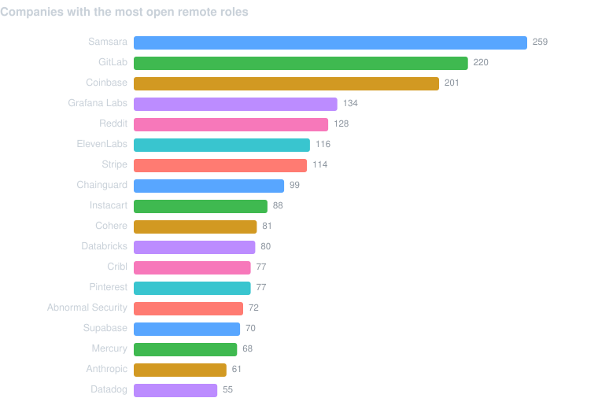

# AI Job Radar

> Daily snapshot of what AI and tech companies are hiring for in remote roles, built from public job-board APIs. Updated every morning by GitHub Actions.

**2026-11-13** — tracking **2,932 open remote roles** across **86 companies** (819 of them engineering roles). 1,745 postings disclose pay. **68 appeared today.**

<sub>Remote-only: 14,709 postings were collected across all locations and 19.9% of them were remote. Set `remote_only` to false in `config/settings.json` to track every location.</sub>

---

## Most-requested skills in remote engineering roles

Share of the 819 remote engineering postings that mention each skill.



<details><summary>Full skill table</summary>

| # | Skill | Category | Postings | Share |
|---:|---|---|---:|---:|
| 1 | Python | Languages | 354 | 43.2% |
| 2 | Observability | Practices | 281 | 34.3% |
| 3 | LLMs | LLM & GenAI | 248 | 30.3% |
| 4 | Go | Languages | 244 | 29.8% |
| 5 | Distributed Systems | Practices | 239 | 29.2% |
| 6 | AI Agents | LLM & GenAI | 236 | 28.8% |
| 7 | Machine Learning | ML Fundamentals | 229 | 28.0% |
| 8 | Kubernetes | Infra & Cloud | 218 | 26.6% |
| 9 | AWS | Infra & Cloud | 196 | 23.9% |
| 10 | TypeScript | Languages | 194 | 23.7% |
| 11 | Statistics | ML Fundamentals | 152 | 18.6% |
| 12 | SQL | Languages | 146 | 17.8% |
| 13 | CI/CD | Practices | 135 | 16.5% |
| 14 | React | Frameworks & Libraries | 128 | 15.6% |
| 15 | Data Pipelines | Data Engineering | 124 | 15.1% |
| 16 | GCP | Infra & Cloud | 119 | 14.5% |
| 17 | Terraform | Infra & Cloud | 111 | 13.6% |
| 18 | Java | Languages | 92 | 11.2% |
| 19 | Snowflake / BigQuery | Data Engineering | 82 | 10.0% |
| 20 | Airflow | Data Engineering | 65 | 7.9% |
| 21 | Azure | Infra & Cloud | 62 | 7.6% |
| 22 | Evals | LLM & GenAI | 62 | 7.6% |
| 23 | Kafka | Data Engineering | 61 | 7.4% |
| 24 | Rust | Languages | 59 | 7.2% |
| 25 | Spark | Data Engineering | 57 | 7.0% |
| 26 | Security | Practices | 56 | 6.8% |
| 27 | MCP | LLM & GenAI | 55 | 6.7% |
| 28 | Databricks | Data Engineering | 50 | 6.1% |
| 29 | Docker | Infra & Cloud | 47 | 5.7% |
| 30 | Linux | Infra & Cloud | 45 | 5.5% |
| 31 | dbt | Data Engineering | 43 | 5.3% |
| 32 | PyTorch | Frameworks & Libraries | 38 | 4.6% |
| 33 | MLOps | Practices | 36 | 4.4% |
| 34 | AI Safety | LLM & GenAI | 35 | 4.3% |
| 35 | Prompt Engineering | LLM & GenAI | 35 | 4.3% |
| 36 | A/B Testing | Practices | 34 | 4.2% |
| 37 | Recommender Systems | ML Fundamentals | 34 | 4.2% |
| 38 | Deep Learning | ML Fundamentals | 31 | 3.8% |
| 39 | RAG | LLM & GenAI | 31 | 3.8% |
| 40 | Multimodal | LLM & GenAI | 27 | 3.3% |

</details>

## Movers

Change in share of postings since 2026-11-06, in percentage points.

| Rising | Δ pp | | Falling | Δ pp |
|---|---:|---|---|---:|
| CI/CD | +0.58 | | Python | -0.70 |
| Observability | +0.44 | | Rust | -0.28 |
| dbt | +0.42 | | NLP | -0.27 |
| Go | +0.39 | | Java | -0.25 |
| A/B Testing | +0.31 | | Machine Learning | -0.24 |
| AWS | +0.30 | | Multimodal | -0.24 |
| TypeScript | +0.29 | | PyTorch | -0.24 |
| React | +0.27 | | Transformers | -0.23 |



## Where the roles are



| Role family | Postings | Share |
|---|---:|---:|
| gtm | 1,174 | 40.0% |
| swe | 454 | 15.5% |
| other | 424 | 14.5% |
| ops | 276 | 9.4% |
| product | 239 | 8.2% |
| infra | 163 | 5.6% |
| ml-ai | 86 | 2.9% |
| data | 68 | 2.3% |
| research | 48 | 1.6% |

## Disclosed pay, remote engineering roles

553 of 819 engineering postings (68%) publish a salary range. Figures are the midpoint of the posted band.

| Percentile | Midpoint |
|---|---:|
| 25th | $196,000 |
| Median | $227,735 |
| 75th | $260,450 |
| 90th | $289,530 |

<details><summary>Highest disclosed engineering bands by company</summary>

| Company | Top posted midpoint |
|---|---:|
| Anthropic | $675,000 |
| OpenAI | $455,500 |
| Pinterest | $371,087 |
| Reddit | $351,000 |
| Harvey | $340,000 |
| Agility Robotics | $329,500 |
| Coinbase | $320,142 |
| Snorkel AI | $316,000 |
| Discord | $306,000 |
| Cohere | $300,000 |

</details>

## Who is hiring most



---

## How this works

Every day at 08:00 UTC a GitHub Actions workflow queries the public job-board APIs of the companies in [`config/companies.json`](config/companies.json) — Greenhouse, Lever and Ashby all expose unauthenticated JSON endpoints. Each posting's description is scanned for the ~66 technologies defined in [`config/skills.json`](config/skills.json), then the description text is discarded and only the derived record is stored.

| Path | What it holds |
|---|---|
| `data/trends.csv` | One row per skill per day — the long-run time series |
| `data/seen.csv` | Every posting id and the date it first appeared |
| `data/snapshots/<week>.json.gz` | Full postings, archived weekly |
| `data/summary.json` | Aggregates for the latest run |
| `config/companies.json` | Tracked companies and their ATS slugs |
| `config/profile.json` | Your skills — drives the daily match issue |
| `config/settings.json` | `remote_only` and other pipeline switches |

### Adding a company

Job boards are keyed by an ATS slug that has to be discovered. Append `Name,slug-guess` lines to a text file and run the prober, which tries all three platforms and keeps whatever answers:

```bash
python src/probe_slugs.py candidates.txt > config/companies.json
```

### Caveats

- Skills are matched by keyword, so a description that merely mentions a technology counts the same as one that requires it.
- Company boilerplate repeated across most of a company's postings is stripped before matching; without that, an "About us" blurb would register as a skill on every role.
- Coverage is limited to companies using Greenhouse, Lever or Ashby. Firms on Workday and Taleo are absent, which skews toward startups and scale-ups.
- Counts include every posted location for a role, so widely-posted roles are represented more than once.
- Remote status comes from each board's own field where one exists and from the posted location otherwise. Ashby's `isRemote` is ignored because boards set it true on hybrid onsite roles; its `workplaceType` is used instead.


<sub>Generated 2026-11-13T15:55:54+00:00 · 5 board(s) unreachable this run</sub>
