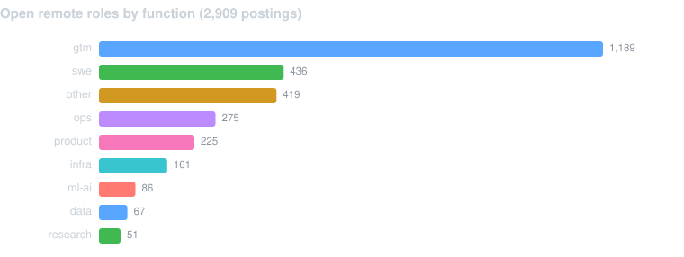

# AI Job Radar

> Daily snapshot of what AI and tech companies are hiring for in remote roles, built from public job-board APIs. Updated every morning by GitHub Actions.

**2026-11-19** — tracking **2,899 open remote roles** across **87 companies** (807 of them engineering roles). 1,728 postings disclose pay. **53 appeared today.**

<sub>Remote-only: 14,670 postings were collected across all locations and 19.8% of them were remote. Set `remote_only` to false in `config/settings.json` to track every location.</sub>

---

## Most-requested skills in remote engineering roles

Share of the 807 remote engineering postings that mention each skill.


<details><summary>Full skill table</summary>

| # | Skill | Category | Postings | Share |
|---:|---|---|---:|---:|
| 1 | Python | Languages | 361 | 44.7% |
| 2 | Observability | Practices | 265 | 32.8% |
| 3 | LLMs | LLM & GenAI | 244 | 30.2% |
| 4 | AI Agents | LLM & GenAI | 238 | 29.5% |
| 5 | Distributed Systems | Practices | 234 | 29.0% |
| 6 | Go | Languages | 231 | 28.6% |
| 7 | Machine Learning | ML Fundamentals | 231 | 28.6% |
| 8 | Kubernetes | Infra & Cloud | 214 | 26.5% |
| 9 | AWS | Infra & Cloud | 192 | 23.8% |
| 10 | TypeScript | Languages | 186 | 23.0% |
| 11 | Statistics | ML Fundamentals | 147 | 18.2% |
| 12 | SQL | Languages | 136 | 16.9% |
| 13 | CI/CD | Practices | 133 | 16.5% |
| 14 | React | Frameworks & Libraries | 122 | 15.1% |
| 15 | GCP | Infra & Cloud | 121 | 15.0% |
| 16 | Data Pipelines | Data Engineering | 113 | 14.0% |
| 17 | Terraform | Infra & Cloud | 107 | 13.3% |
| 18 | Java | Languages | 96 | 11.9% |
| 19 | Snowflake / BigQuery | Data Engineering | 78 | 9.7% |
| 20 | Airflow | Data Engineering | 66 | 8.2% |
| 21 | Evals | LLM & GenAI | 64 | 7.9% |
| 22 | Rust | Languages | 63 | 7.8% |
| 23 | Kafka | Data Engineering | 61 | 7.6% |
| 24 | Azure | Infra & Cloud | 61 | 7.6% |
| 25 | Security | Practices | 59 | 7.3% |
| 26 | Spark | Data Engineering | 59 | 7.3% |
| 27 | MCP | LLM & GenAI | 49 | 6.1% |
| 28 | Docker | Infra & Cloud | 47 | 5.8% |
| 29 | Databricks | Data Engineering | 44 | 5.5% |
| 30 | PyTorch | Frameworks & Libraries | 43 | 5.3% |
| 31 | Linux | Infra & Cloud | 43 | 5.3% |
| 32 | dbt | Data Engineering | 40 | 5.0% |
| 33 | Recommender Systems | ML Fundamentals | 39 | 4.8% |
| 34 | AI Safety | LLM & GenAI | 38 | 4.7% |
| 35 | MLOps | Practices | 37 | 4.6% |
| 36 | Multimodal | LLM & GenAI | 33 | 4.1% |
| 37 | Deep Learning | ML Fundamentals | 33 | 4.1% |
| 38 | RAG | LLM & GenAI | 33 | 4.1% |
| 39 | Prompt Engineering | LLM & GenAI | 32 | 4.0% |
| 40 | Fine-tuning | LLM & GenAI | 30 | 3.7% |

</details>

## Movers

Change in share of postings since 2026-11-12, in percentage points.

| Rising | Δ pp | | Falling | Δ pp |
|---|---:|---|---|---:|
| AI Agents | +0.39 | | Data Pipelines | -0.63 |
| Embeddings | +0.35 | | Observability | -0.48 |
| GCP | +0.21 | | LLMs | -0.41 |
| PyTorch | +0.18 | | A/B Testing | -0.40 |
| TensorFlow | +0.18 | | Go | -0.34 |
| Ray | +0.18 | | Statistics | -0.31 |
| CI/CD | +0.16 | | SQL | -0.28 |
| Python | +0.15 | | Distributed Systems | -0.23 |


## Where the roles are



| Role family | Postings | Share |
|---|---:|---:|
| gtm | 1,184 | 40.8% |
| swe | 433 | 14.9% |
| other | 420 | 14.5% |
| ops | 272 | 9.4% |
| product | 216 | 7.5% |
| infra | 163 | 5.6% |
| ml-ai | 90 | 3.1% |
| data | 68 | 2.3% |
| research | 53 | 1.8% |

## Disclosed pay, remote engineering roles

550 of 807 engineering postings (68%) publish a salary range. Figures are the midpoint of the posted band.

| Percentile | Midpoint |
|---|---:|
| 25th | $196,285 |
| Median | $228,500 |
| 75th | $260,450 |
| 90th | $300,000 |

<details><summary>Highest disclosed engineering bands by company</summary>

| Company | Top posted midpoint |
|---|---:|
| Anthropic | $675,000 |
| OpenAI | $455,500 |
| Pinterest | $371,087 |
| Reddit | $351,000 |
| Harvey | $340,000 |
| Agility Robotics | $329,500 |
| Coinbase | $320,142 |
| Snorkel AI | $316,000 |
| Discord | $310,000 |
| Cohere | $300,000 |

</details>

## Who is hiring most


---

## How this works

Every day at 08:00 UTC a GitHub Actions workflow queries the public job-board APIs of the companies in [`config/companies.json`](config/companies.json) — Greenhouse, Lever and Ashby all expose unauthenticated JSON endpoints. Each posting's description is scanned for the ~66 technologies defined in [`config/skills.json`](config/skills.json), then the description text is discarded and only the derived record is stored.

| Path | What it holds |
|---|---|
| `data/trends.csv` | One row per skill per day — the long-run time series |
| `data/seen.csv` | Every posting id and the date it first appeared |
| `data/snapshots/<week>.json.gz` | Full postings, archived weekly |
| `data/summary.json` | Aggregates for the latest run |
| `config/companies.json` | Tracked companies and their ATS slugs |
| `config/profile.json` | Your skills — drives the daily match issue |
| `config/settings.json` | `remote_only` and other pipeline switches |

### Adding a company

Job boards are keyed by an ATS slug that has to be discovered. Append `Name,slug-guess` lines to a text file and run the prober, which tries all three platforms and keeps whatever answers:

```bash
python src/probe_slugs.py candidates.txt > config/companies.json
```

### Caveats

- Skills are matched by keyword, so a description that merely mentions a technology counts the same as one that requires it.
- Company boilerplate repeated across most of a company's postings is stripped before matching; without that, an "About us" blurb would register as a skill on every role.
- Coverage is limited to companies using Greenhouse, Lever or Ashby. Firms on Workday and Taleo are absent, which skews toward startups and scale-ups.
- Counts include every posted location for a role, so widely-posted roles are represented more than once.
- Remote status comes from each board's own field where one exists and from the posted location otherwise. Ashby's `isRemote` is ignored because boards set it true on hybrid onsite roles; its `workplaceType` is used instead.


<sub>Generated 2026-11-19T17:02:44+00:00 · 5 board(s) unreachable this run</sub>
